# Ejercicios Prácticos de Docker

> **Reglas generales:** En todos los ejercicios, documenta los comandos que uses y el resultado (captura o salida).

---

## Ejercicio 1: Imágenes + Contenedores + Capas (Inspección y Práctica)

**Objetivo:** Entender "imagen vs contenedor", capas y cómo se ejecuta algo real.

### 1. Descarga imágenes base

```bash
docker pull ubuntu:22.04
docker pull nginx:1.25
```

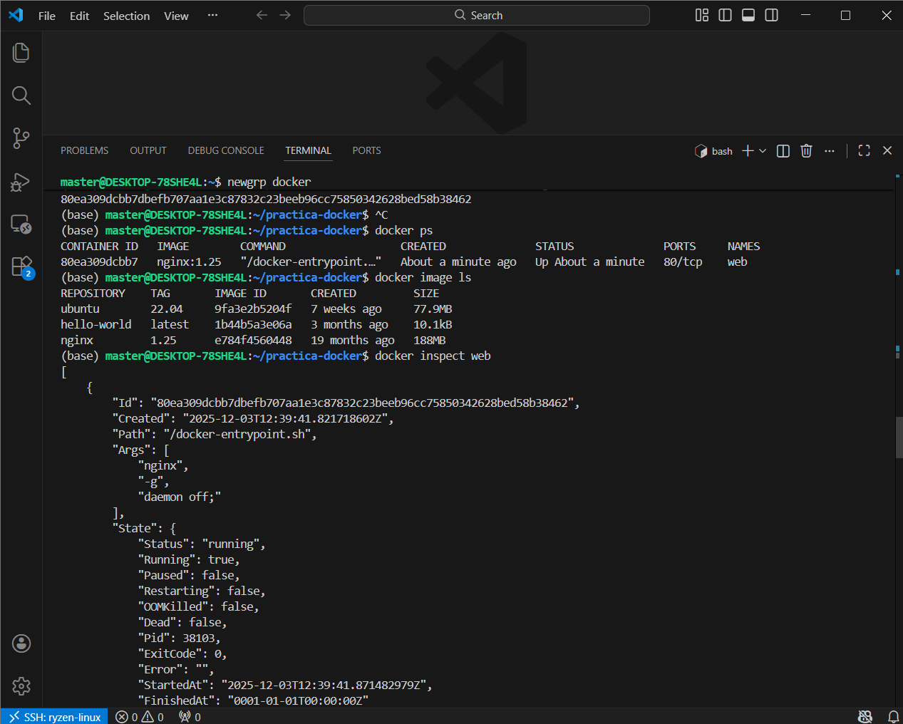

### 2. Ejecuta contenedores

**Contenedor efímero:**
```bash
docker run --rm ubuntu:22.04 echo "hola"
```

**Contenedor persistente:**
```bash
docker run -d --name web nginx:1.25
```

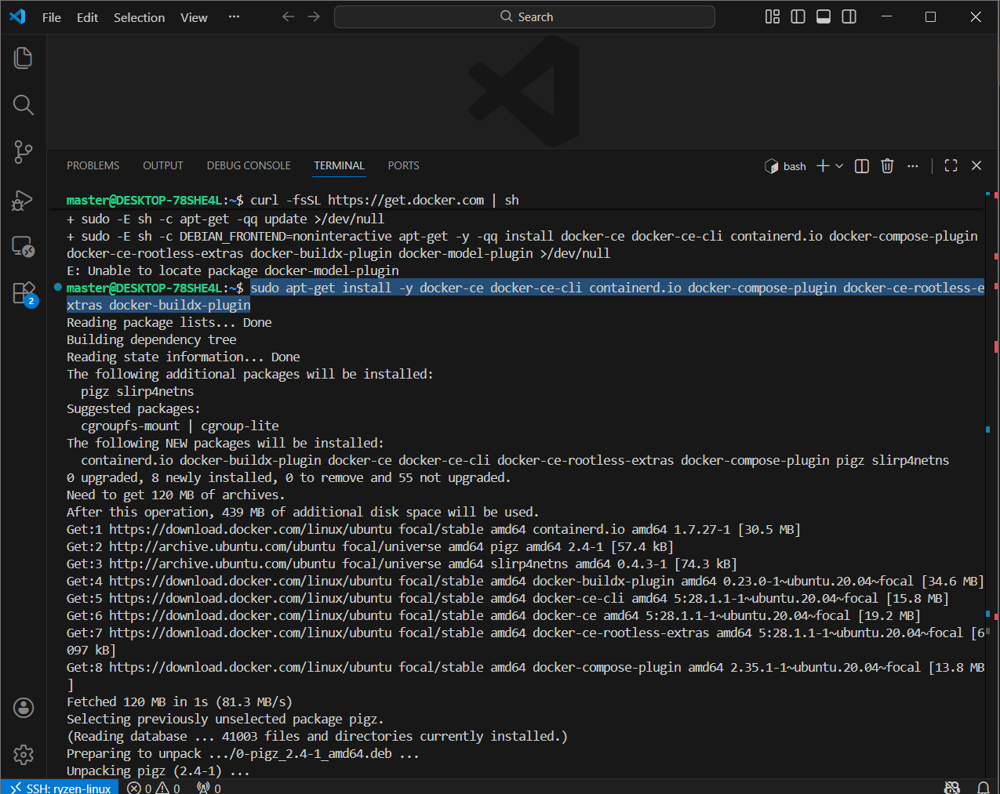

### 3. Inspecciona

```bash
docker image ls
docker ps
docker inspect web
```

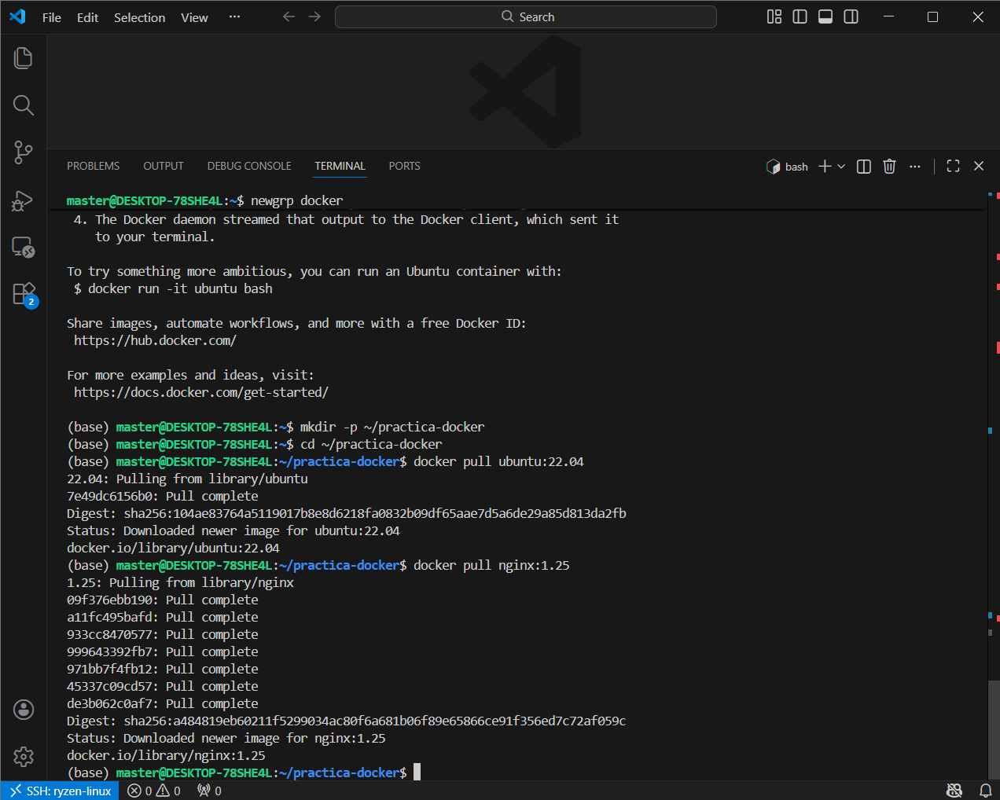

### 4. Demuestra la capa de escritura

1. Accede al contenedor:
```bash
docker exec -it web sh
```

2. Crea un archivo dentro:
```bash
echo "archivo temporal" > /tmp/test.txt
exit
```

3. Borra el contenedor y crea otro:
```bash
docker rm -f web
docker run -d --name web nginx:1.25
docker exec -it web ls /tmp/test.txt  # No existirá
```

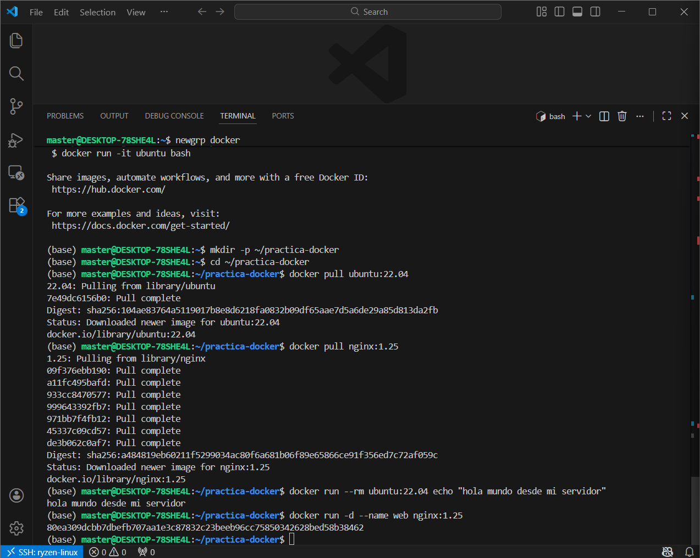

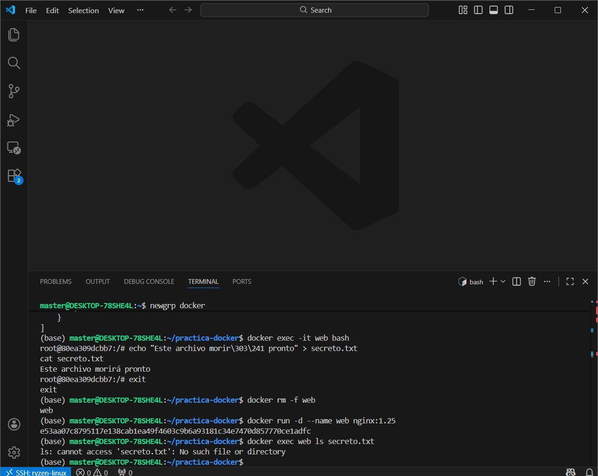

**Entregable:** Explicación corta + comandos demostrando que los cambios en la capa de escritura se pierden al eliminar el contenedor.

---

## Ejercicio 2: Persistencia - Volúmenes y Bind Mounts

**Objetivo:** Comprobar qué se pierde y qué se conserva.

### Parte A: Volúmenes

1. Crea un volumen:
```bash
docker volume create datos_app
```

2. Monta el volumen en un contenedor:
```bash
docker run -it --rm -v datos_app:/data ubuntu:22.04
```

3. Dentro del contenedor, crea un archivo:
```bash
echo "datos persistentes" > /data/archivo.txt
exit
```

4. Crea otro contenedor con el mismo volumen y verifica:
```bash
docker run -it --rm -v datos_app:/data ubuntu:22.04 cat /data/archivo.txt
```

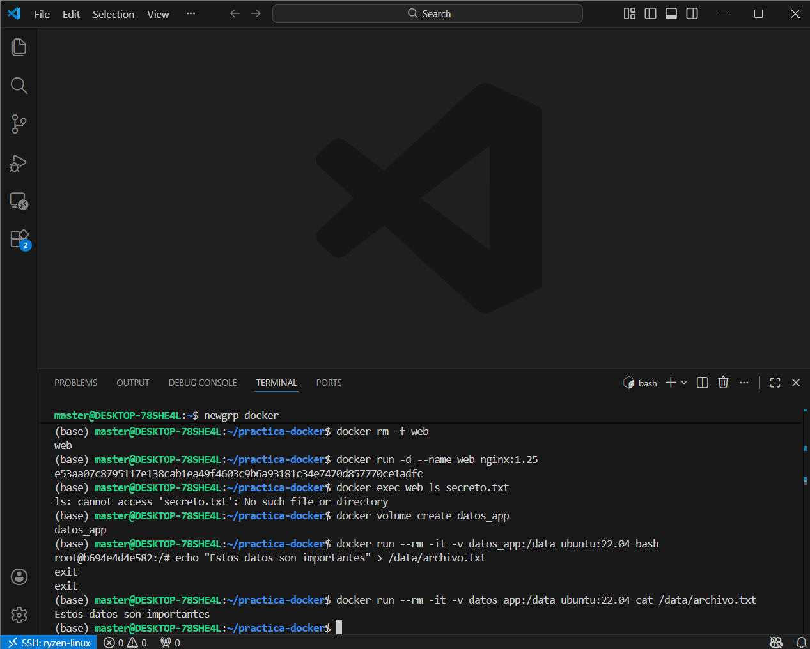

### Parte B: Bind Mounts

1. Crea una carpeta en tu host:
```bash
mkdir shared
```

2. Monta la carpeta en un contenedor:
```bash
docker run -it --rm -v $(pwd)/shared:/app ubuntu:22.04
```

3. Dentro del contenedor, crea un archivo:
```bash
echo "compartido" > /app/test.txt
exit
```

4. Verifica en tu host:
```bash
cat shared/test.txt
```

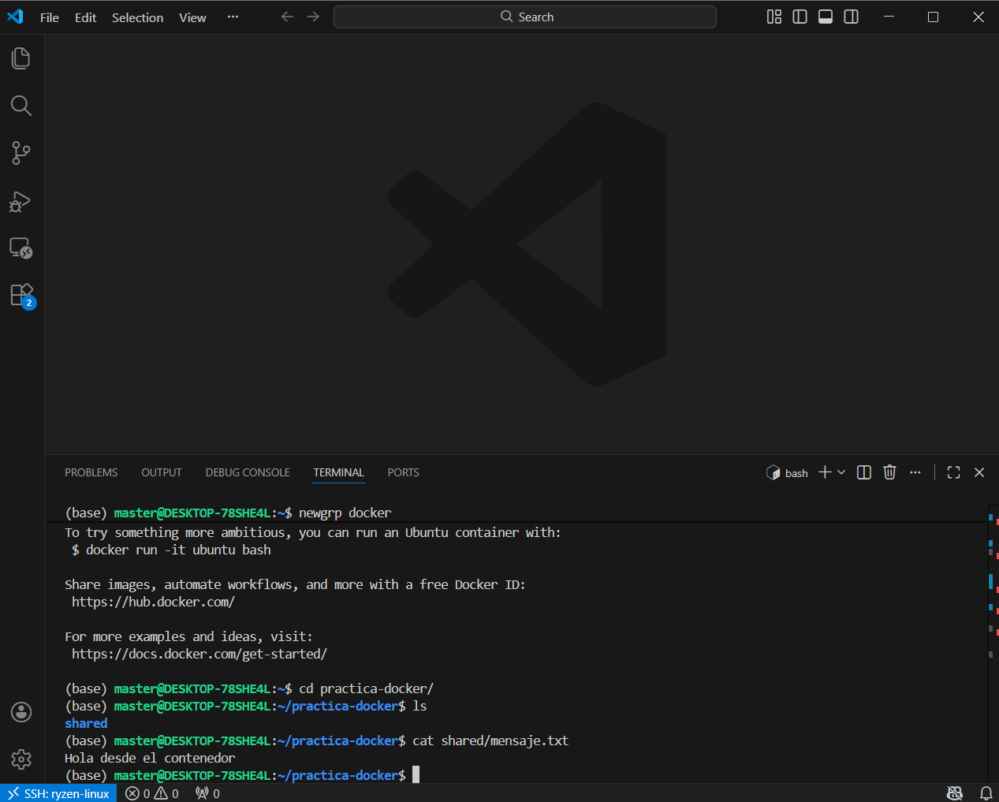

### Parte C: Montaje de solo lectura (Extra)

```bash
docker run -it --rm -v $(pwd)/shared:/app:ro ubuntu:22.04
# Intenta escribir en /app - debería fallar
```

**Entregable:** Diferencias prácticas entre volumen y bind mount:
- **Volúmenes:** Gestionados por Docker, portables, mejor para producción
- **Bind mounts:** Vinculados al sistema de archivos del host, útiles para desarrollo

---

## Ejercicio 3: Dockerfile + Build + Run (Buenas Prácticas Mínimas)

**Objetivo:** Construir tu propia imagen y ejecutarla como contenedor.

### Opción A: FastAPI "Hello"

1. Crea un archivo `main.py`:
```python
from fastapi import FastAPI
app = FastAPI()

@app.get("/")
def read_root():
    return {"message": "Hello from Docker!"}
```

2. Crea un archivo `requirements.txt`:
```
fastapi==0.104.1
uvicorn==0.24.0
```

3. Crea un `Dockerfile`:
```dockerfile
FROM python:3.11-slim
WORKDIR /app
COPY requirements.txt .
RUN pip install --no-cache-dir -r requirements.txt
COPY main.py .
EXPOSE 8000
CMD ["uvicorn", "main:app", "--host", "0.0.0.0", "--port", "8000"]
```

### Opción B: Python Script

1. Crea un archivo `app.py`:
```python
import os
import platform

print(f"Python version: {platform.python_version()}")
print(f"OS: {platform.system()}")
print(f"Environment variables: {list(os.environ.keys())[:5]}")
```

2. Crea un `Dockerfile`:
```dockerfile
FROM python:3.11-slim
WORKDIR /app
COPY app.py .
CMD ["python", "app.py"]
```

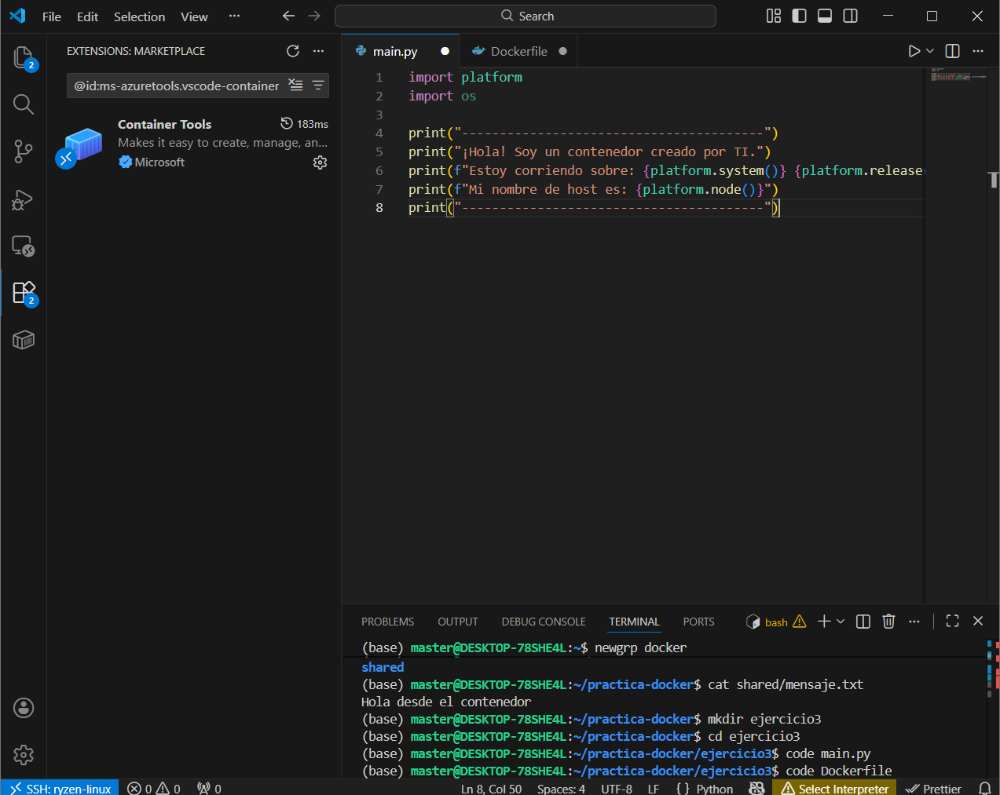

### Build y Run

```bash
# Build
docker build -t tuapp:1.0 .

# Run (script)
docker run --rm tuapp:1.0

# Run (web)
docker run --rm -p 8000:8000 tuapp:1.0
```

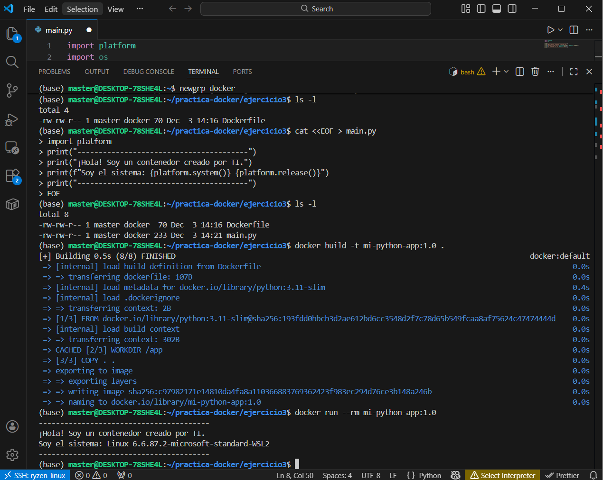

**Entregable:** Dockerfile + explicación de cada línea:
- `FROM`: Imagen base (Python 3.11 slim para reducir tamaño)
- `WORKDIR`: Directorio de trabajo dentro del contenedor
- `COPY`: Copia archivos del host al contenedor
- `RUN`: Ejecuta comandos durante el build (instalar dependencias)
- `EXPOSE`: Documenta el puerto (no lo publica automáticamente)
- `CMD`: Comando por defecto al ejecutar el contenedor

---

## Ejercicio 4: Versionado y Etiquetado + Push/Pull

**Objetivo:** Usar tags y entender por qué importan.

### 1. Re-etiqueta tu imagen

```bash
docker tag tuapp:1.0 tuapp:1.0.0
docker tag tuapp:1.0 tuapp:1.0.1
docker tag tuapp:1.0 tuapp:dev
```

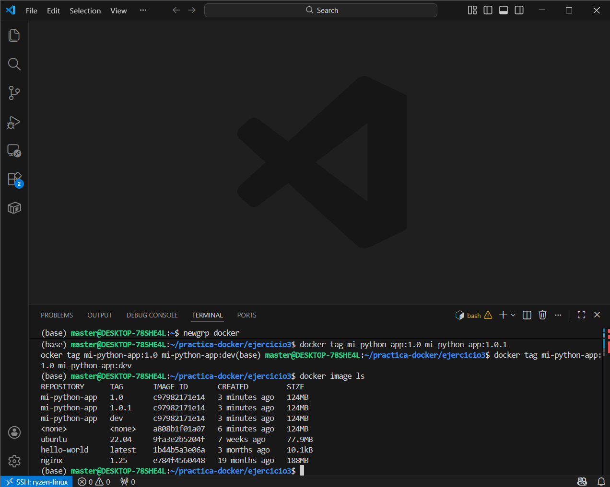

### 2. Lista imágenes

```bash
docker image ls | grep tuapp
```

**Lo que deberías ver:** Varias etiquetas apuntando al mismo IMAGE ID (si no has modificado nada).

### 3. Cuándo usar cada tipo de tag

| Tipo de Tag | Ejemplo | Cuándo usarlo |
|-------------|---------|---------------|
| **SemVer** | `1.2.3`, `1.0.0` | Releases oficiales, control de versiones estricto |
| **Entorno** | `dev`, `staging`, `prod` | Diferenciar ambientes de despliegue |
| **Commit** | `git-abc1234` | Rastrear exactamente qué código contiene |
| **Latest** | `latest` | Última versión estable (cuidado en producción) |
| **Fecha** | `2024-01-15` | Snapshots temporales |

**Entregable:** Tabla de tags que has creado y qué significan.

---

## Ejercicio 5: Docker Hub - Publicar tu Imagen (OPCIONAL PERO RECOMENDABLE)

**Objetivo:** Experimentar el flujo real de compartir imágenes.

### 1. Login en Docker Hub

```bash
docker login
```

### 2. Etiqueta para Docker Hub

```bash
docker tag tuapp:1.0.0 TUUSUARIO/tuapp:1.0.0
```

### 3. Push a Docker Hub

```bash
docker push TUUSUARIO/tuapp:1.0.0
```

### 4. Simula "otro PC"

```bash
# Borra la imagen local
docker image rm TUUSUARIO/tuapp:1.0.0

# Pull de nuevo
docker pull TUUSUARIO/tuapp:1.0.0

# Ejecútala
docker run --rm TUUSUARIO/tuapp:1.0.0
```

**Entregable:** Enlace al repositorio (si es público) o captura de Docker Hub mostrando tu imagen publicada.

---

## Ejercicio 6: Redes - Aislar Servicios y Comunicar por Hostname

**Objetivo:** Entender redes bridge, DNS interno y exposición de puertos.

### 1. Crea una red personalizada

```bash
docker network create red_prueba
```

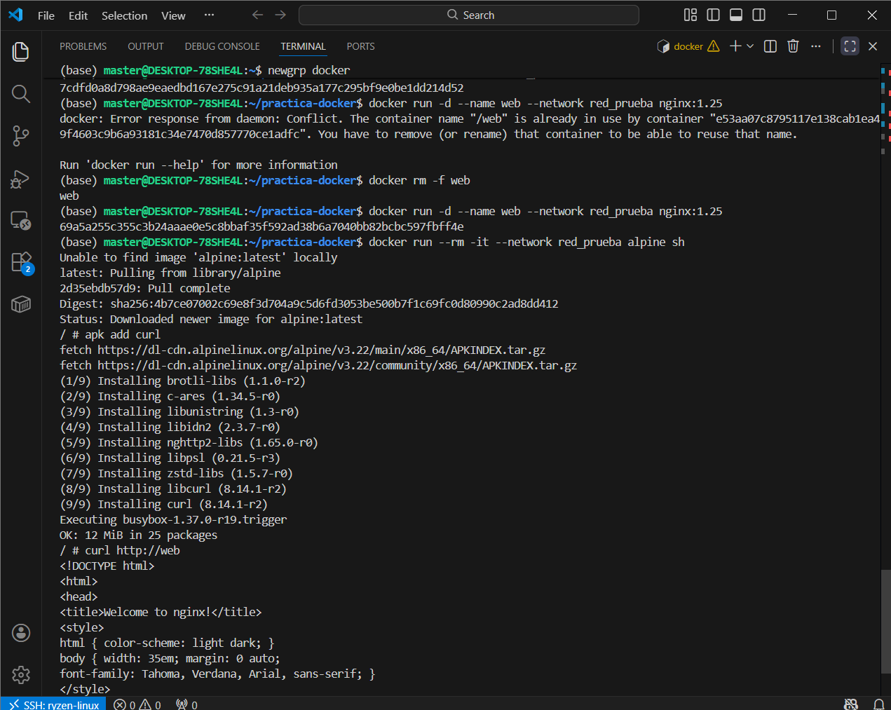

### 2. Levanta 2 contenedores en esa red

```bash
# Contenedor web (nginx)
docker run -d --name web --network red_prueba nginx:1.25

# Contenedor cliente (alpine)
docker run -it --name cliente --network red_prueba alpine sh
```

### 3. Desde alpine, haz petición por nombre

Dentro del contenedor alpine:
```bash
apk add curl
curl http://web
```

**Lo que deberías ver:** El HTML de la página por defecto de nginx.

### 4. Publica el puerto al host

```bash
docker rm -f web
docker run -d --name web --network red_prueba -p 8080:80 nginx:1.25
```

Ahora accede desde tu navegador: `http://localhost:8080`

**Entregable:** Explicación de las diferencias:

### Comunicación por nombre dentro de red
- Los contenedores en la misma red personalizada pueden comunicarse usando el **nombre del contenedor** como hostname
- Docker proporciona **DNS interno** automático
- **No necesita** publicar puertos
- Ideal para comunicación **entre servicios** (microservicios)

### Comunicación por puerto en host
- Usa `-p HOST_PORT:CONTAINER_PORT` para exponer el puerto al host
- Accesible desde **fuera de Docker** (navegador, otras aplicaciones)
- Necesario para servicios que deben ser **accesibles públicamente**
- El DNS interno **sigue funcionando** dentro de la red

---

## Resumen de Conceptos Clave

### Imágenes vs Contenedores
- **Imagen:** Plantilla inmutable, solo lectura
- **Contenedor:** Instancia en ejecución de una imagen con capa de escritura temporal

### Persistencia
- **Volúmenes:** Gestionados por Docker (`/var/lib/docker/volumes/`)
- **Bind mounts:** Vinculados al filesystem del host
- **tmpfs:** En memoria RAM (no persiste al detener)

### Dockerfile Best Practices
- Usar imágenes base específicas (`python:3.11-slim` vs `python:latest`)
- Ordenar comandos de menos a más cambiantes (aprovechar caché)
- Minimizar capas combinando `RUN` cuando sea posible
- Usar `.dockerignore` para excluir archivos innecesarios

### Redes
- **bridge (default):** Aislada pero sin DNS automático
- **bridge personalizada:** Aislada CON DNS automático
- **host:** Usa la red del host directamente
- **none:** Sin red

---

## Checklist de Entrega

- [ ] Ejercicio 1: Comandos + explicación de capas efímeras
- [ ] Ejercicio 2: Diferencias volumen vs bind mount
- [ ] Ejercicio 3: Dockerfile comentado + captura de ejecución
- [ ] Ejercicio 4: Tabla de tags y estrategia de versionado
- [ ] Ejercicio 5 (opcional): Enlace a Docker Hub o captura
- [ ] Ejercicio 6: Explicación de comunicación interna vs externa

---

## Recursos Adicionales

- [Documentación oficial de Docker](https://docs.docker.com/)
- [Docker Hub](https://hub.docker.com/)
- [Dockerfile Best Practices](https://docs.docker.com/develop/develop-images/dockerfile_best-practices/)
- [Docker Networking](https://docs.docker.com/network/)