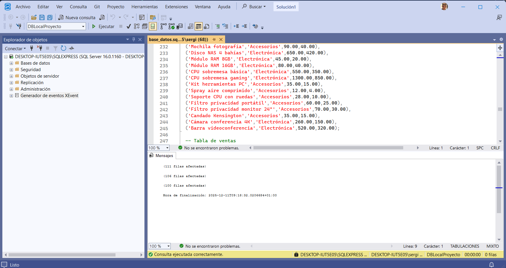
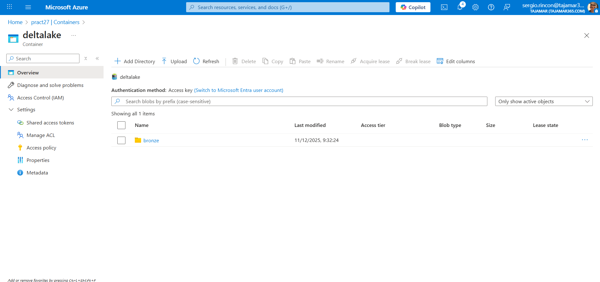
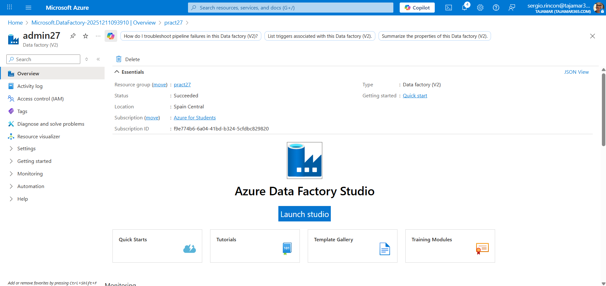
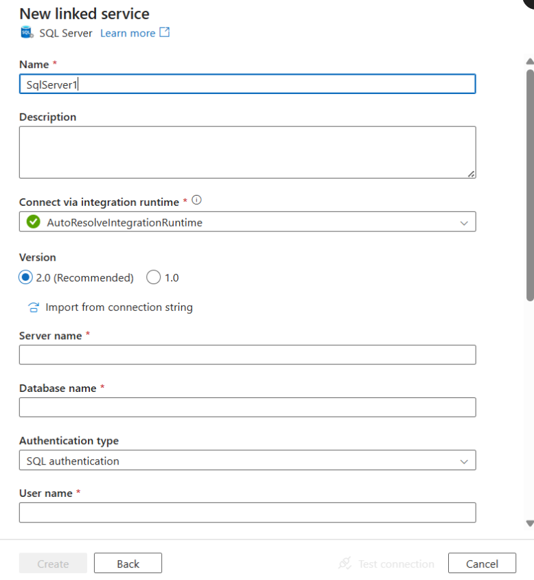

# Práctica 27: De SQL Server Local a Lakehouse, Power BI y ML

## 📋 Resumen del Proyecto

Este proyecto consiste en migrar datos desde un **SQL Server local** hacia un **Lakehouse en Azure** (Data Lake Storage Gen2), para luego procesarlos con **Databricks**, crear modelos de **Machine Learning** y visualizarlos con **Power BI**.

---

## ✅ Progreso Completado

### Paso 1: Base de Datos Local en SQL Server

Se ejecutó el script `base_datos.sql` en SQL Server Management Studio para crear la base de datos `DBLocalProyecto` con las siguientes tablas:

| Tabla | Registros |
|-------|-----------|
| Clientes | 111 filas |
| Productos | 106 filas |
| Ventas | 100 filas |

**Servidor:** `DESKTOP-IUT5E05\SQLEXPRESS`



---

### Paso 2: Recursos de Azure

#### 2.1 Resource Group
- **Nombre:** `pract27`
- **Ubicación:** Spain Central

#### 2.2 Storage Account (Data Lake Gen2)
- **Nombre:** `pract27`
- **Tipo:** Storage Account con Hierarchical Namespace habilitado (Data Lake Gen2)
- **Ubicación:** Spain Central


#### 2.3 Container y Estructura
```
deltalake/
  └── bronze/
        ├── clientes/     (pendiente - se creará con Data Factory)
        ├── productos/    (pendiente)
        └── ventas/       (pendiente)
```

> ⚠️ **Nota:** Guardar la Access Key del Storage Account para usarla después en Databricks.

---

### Paso 3: Azure Data Factory

- **Nombre:** `admin27`
- **Tipo:** Data Factory (V2)
- **Ubicación:** Spain Central
- **Resource Group:** `pract27`

---

### Paso 4: Integration Runtime (En Progreso)

Se inició la configuración del **Integration Runtime Self-Hosted** necesario para conectar el SQL Server local con Azure Data Factory.

- **Nombre:** `integrationRuntime1`
- **Estado:** Pendiente de instalación

> 🔧 **Siguiente paso:** Descargar e instalar el Integration Runtime en el PC local para establecer la conexión entre SQL Server y Azure.

---

## 📁 Archivos del Proyecto

| Archivo | Descripción |
|---------|-------------|
| `base_datos.sql` | Script SQL para crear la base de datos con tablas y datos de ejemplo |
| `top_ventas.sql` | Consulta SQL simple para obtener las 10 primeras ventas |
| `ConfiguracionScopes.ipynb` | Notebook de Databricks para configurar secretos (credenciales) |
| `LecturaTablas.ipynb` | Notebook que lee archivos Parquet desde Azure Storage y crea tablas Delta |
| `PreaparaDatosML.ipynb` | Notebook con modelo de ML (regresión lineal) para predecir gastos de clientes |
| `GuiaProyecto.pdf` | Guía del proyecto |
| `Local_SQL_to_Azure_Data_Intelligence.pdf` | Documentación detallada |

---

## 🔜 Pasos Pendientes

1. [ ] **Crear Pipeline** en Data Factory para copiar las 3 tablas a formato Parquet
2. [ ] **Ejecutar Pipeline** y verificar datos en Storage Account
3. [ ] **Configurar Azure Databricks**:
   - Crear workspace
   - Configurar scopes y secretos
   - Ejecutar notebooks para crear tablas Delta
4. [ ] **Entrenar modelo ML** con Spark MLlib
5. [ ] **Conectar Power BI** al Lakehouse para visualización

---

## 🏗️ Arquitectura

```
┌─────────────────┐      ┌─────────────────┐      ┌─────────────────┐
│   SQL Server    │      │  Azure Data     │      │  Azure Data     │
│     Local       │ ───► │    Factory      │ ───► │  Lake Gen2      │
│ (DBLocalProyecto)│      │   (admin27)     │      │   (pract27)     │
└─────────────────┘      └─────────────────┘      └─────────────────┘
                                                          │
                                                          ▼
┌─────────────────┐      ┌─────────────────┐      ┌─────────────────┐
│    Power BI     │ ◄─── │    Databricks   │ ◄─── │  Delta Lake     │
│  (Visualización)│      │   (ML + ETL)    │      │   (bronze/)     │
└─────────────────┘      └─────────────────┘      └─────────────────┘
```

---

## 📝 Notas Importantes

- **Storage Account Key:** Guardar de forma segura para configurar Databricks
- **Integration Runtime:** Necesario instalarlo en el PC donde está SQL Server
- El container `deltalake` con la carpeta `bronze` ya están creados y listos para recibir los datos

---

*Última actualización: 11/12/2025*
