# ETL con PostgreSQL y Base de Datos Vectorial - Mi Réplica

Este documento documenta mi réplica del flujo ETL para la práctica de Base de Datos Vectorial con pgvector, migrando datos desde PostgreSQL local a Azure y orquestando con Azure Data Factory.

---

## 1. Creación de BD y Carga de Datos en PostgreSQL

> **Nota:** Este paso se omite en mi réplica. Utilizo el archivo `fer_vct_backup.dump` pre-existente que contiene los embeddings vectoriales del dataset FER2013 (28,709 registros).

---

## 2. Ingesta y Migración a Azure

### 2.1 Crear Azure Database for PostgreSQL

Desplegué el servicio **Azure Database for PostgreSQL Flexible Server**:
- **Server name:** `pgvectorsergio`
- **Region:** Spain Central
- **PostgreSQL version:** 16
- **Compute:** Burstable B2s (desarrollo)

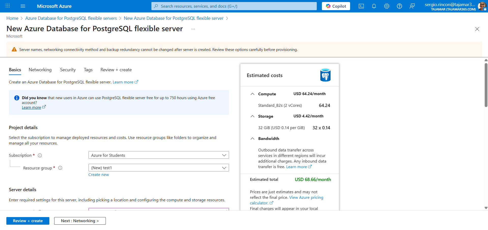

### 2.2 Configurar Networking y Firewall

En la sección Networking:
- Habilitado acceso público
- Añadida mi IP pública
- Permitido acceso desde servicios de Azure

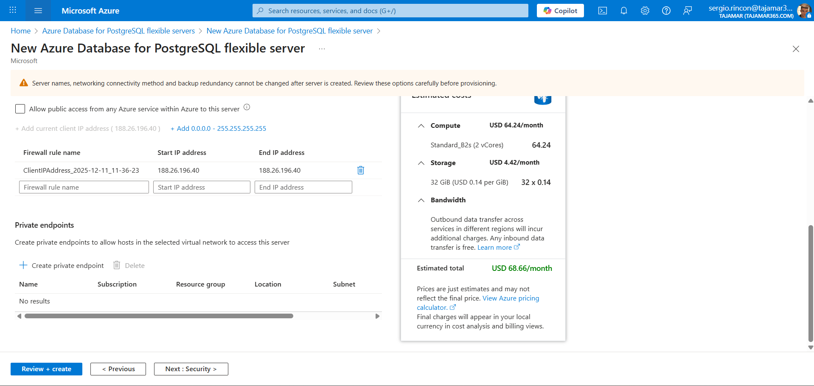

### 2.3 Habilitar Extensión pgvector

En **Server parameters** → `azure.extensions` → Seleccioné `VECTOR`

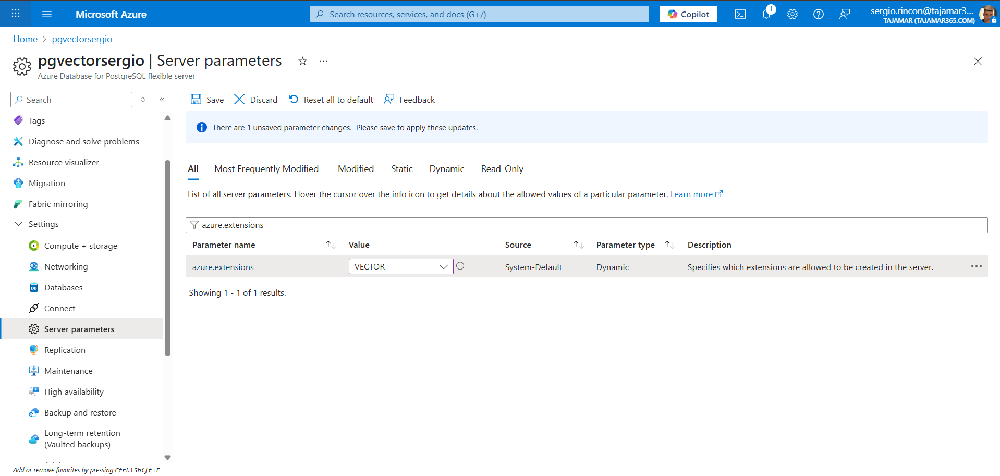

### 2.4 Crear Base de Datos y Extensión

Conecté desde terminal local:

```powershell
& "C:\Program Files\PostgreSQL\18\bin\psql.exe" -h pgvectorsergio.postgres.database.azure.com -p 5432 -U adminpg -d postgres
```

Ejecuté:
```sql
CREATE DATABASE fer_vct;
\c fer_vct
CREATE EXTENSION vector;
```

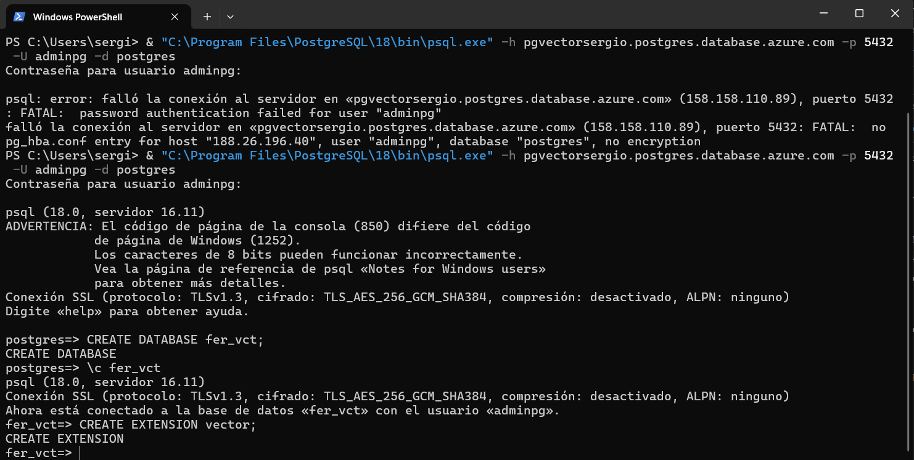

### 2.5 Importar Datos con pg_restore

```powershell
& "C:\Program Files\PostgreSQL\18\bin\pg_restore.exe" -h pgvectorsergio.postgres.database.azure.com -p 5432 -U adminpg -d fer_vct -v ".\codes\fer_vct_backup.dump"
```


### 2.6 Verificación

```sql
SELECT COUNT(*) FROM imagenes_fer;
-- Resultado: 28,709 registros
```

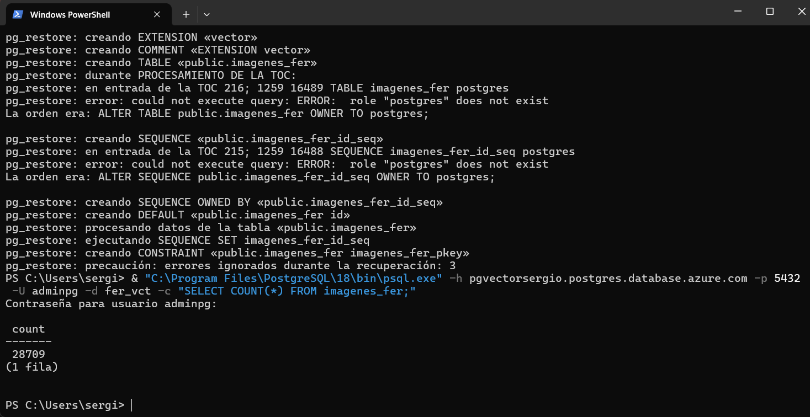

---

## 3. Orquestación con Azure Data Factory

### 3.1 Crear Storage Account con Data Lake Gen2

Creé Storage Account con **Hierarchical namespace habilitado**:
- **Name:** `datalakefersergio`
- **Contenedores:** `origen-imagenes-fer`, `raw`

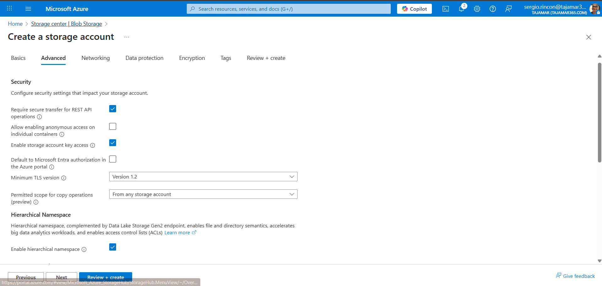

### 3.2 Subir Imágenes a Blob Storage

Subí las imágenes del dataset FER2013 al contenedor `origen-imagenes-fer`.

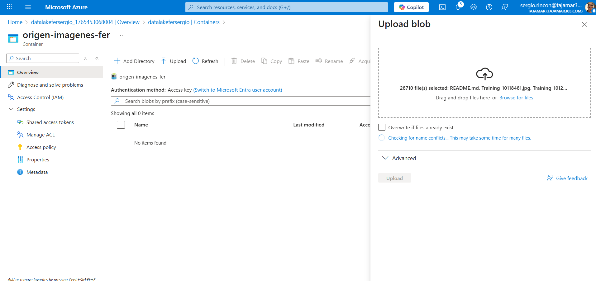

### 3.3 Crear Azure Data Factory

Creé el recurso **adf-fer-sergio** en Azure Data Factory.

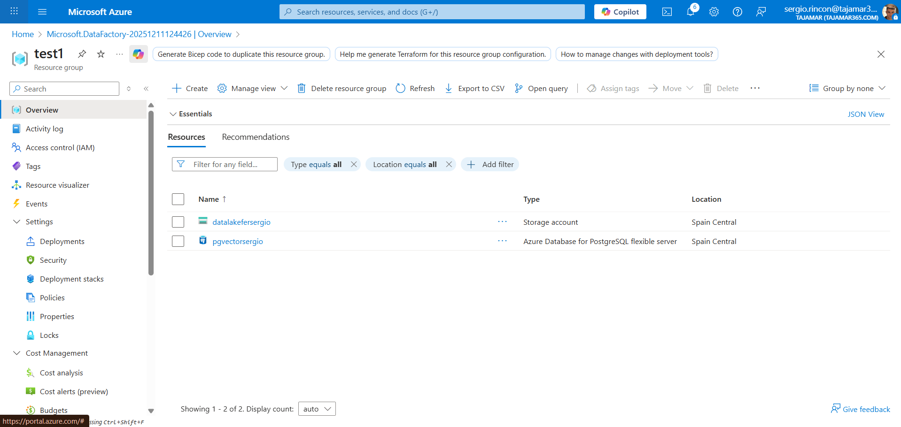

### 3.4 Configurar Linked Services

Creé 3 Linked Services:

| Nombre | Tipo | Propósito |
|--------|------|-----------|
| LS_PostgreSQL_FerVct | Azure Database for PostgreSQL | Origen de embeddings |
| LS_DataLake | Azure Data Lake Storage Gen2 | Data Lakehouse |
| LS_BlobStorage | Azure Blob Storage | Origen de imágenes |

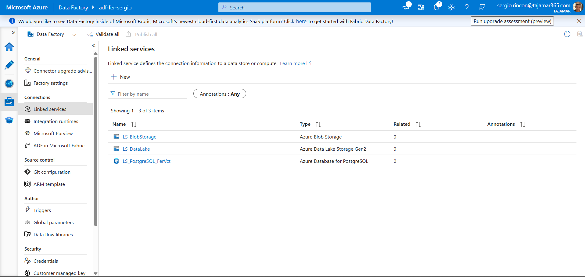

### 3.5 Crear Datasets

Creé 4 Datasets:

| Dataset | Tipo | Propósito |
|---------|------|-----------|
| DS_PostgreSQL_Embeddings | PostgreSQL | Origen embeddings |
| DS_Lakehouse_Embeddings | ADLS Gen2 Parquet | Destino embeddings |
| DS_Blob_Images | Blob Binary | Origen imágenes |
| DS_Lakehouse_Images | ADLS Gen2 Binary | Destino imágenes |

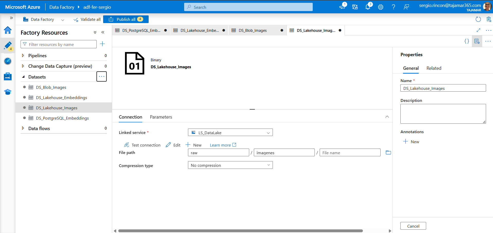

### 3.6 Crear Pipeline

Pipeline: **PL_Migrar_Datos_FER** con 2 actividades Copy Data:

**Actividad 1: DS_PostgreSQL_Embeddings**
- Query SQL con conversión de vector a texto:
```sql
SELECT id, emotion, vector::text AS vector, 'raw/imagenes/train/' || filepath AS filepath FROM public.imagenes_fer;
```

**Actividad 2: Copy_Images**
- Copy behavior: Preserve hierarchy

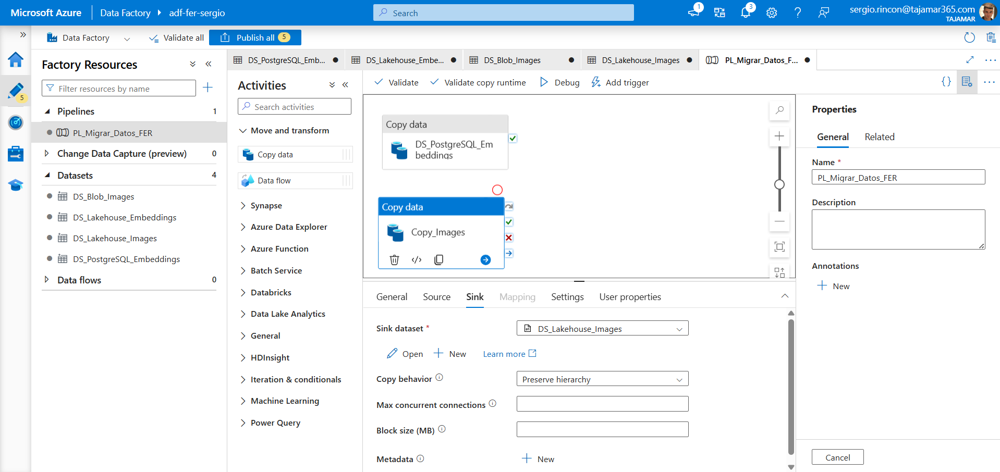

### 3.7 Ejecución Exitosa

Pipeline ejecutado con éxito en modo Debug:
- ✅ DS_PostgreSQL_Embeddings: Succeeded
- ✅ Copy_Images: Succeeded

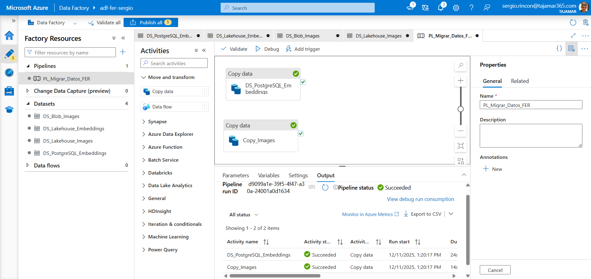

---

## 4. Conexión con Microsoft AI Foundry

> **Pendiente:** Este paso queda pendiente para futuras iteraciones. El Data Lake está listo para conectarse con Azure AI Foundry.

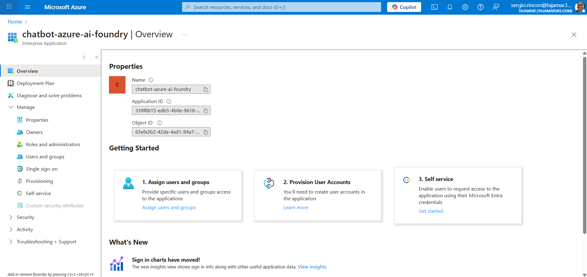

---

## Recursos Creados en Azure

| Recurso | Nombre | Tipo |
|---------|--------|------|
| PostgreSQL | pgvectorsergio | Azure Database for PostgreSQL |
| Storage | datalakefersergio | Storage Account (ADLS Gen2) |
| Data Factory | adf-fer-sergio | Azure Data Factory |

---

## Resumen

✅ Base de datos vectorial migrada a Azure PostgreSQL (28,709 embeddings)  
✅ Storage Account con Data Lake Gen2 configurado  
✅ Pipeline ETL en Azure Data Factory funcionando  
✅ Embeddings exportados a formato Parquet  
✅ Imágenes copiadas preservando estructura de carpetas  
⏳ Conexión con AI Foundry pendiente
