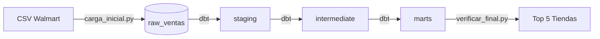

# Práctica 34 - Pipeline ELT con dbt

Pipeline ELT (Extract, Load, Transform) para análisis de ventas de Walmart utilizando **dbt** (data build tool), **PostgreSQL** y **Docker**.

## 🎯 Objetivo

Crear un pipeline de datos completo siguiendo las mejores prácticas de ingeniería de datos moderna con dbt, implementando una arquitectura de capas (staging → intermediate → marts).

## 🛠️ Stack Tecnológico

| Tecnología | Uso |
|------------|-----|
| **dbt** | Transformación y modelado de datos |
| **PostgreSQL** | Data Warehouse |
| **Docker** | Contenedorización de la base de datos |
| **Python** | Scripts de ingesta y verificación |

## 📁 Estructura del Proyecto

```
practica_34-ELT-con-dbt/
├── data/                    # Datos de origen (CSV)
├── dbt_project/             # Proyecto dbt
│   ├── models/
│   │   ├── staging/         # Modelos de staging (stg_)
│   │   ├── intermediate/    # Modelos intermedios (int_)
│   │   └── marts/           # Modelos finales para análisis
│   ├── dbt_project.yml      # Configuración del proyecto
│   └── profiles.yml         # Perfil de conexión
├── scripts/
│   ├── carga_inicial.py     # Script de ingesta (Extract & Load)
│   └── verificar_final.py   # Script de verificación
├── docker-compose.yml       # Infraestructura PostgreSQL
└── guia_uso.md              # Guía detallada de instalación
```

## 🚀 Guía Rápida de Instalación

### Requisitos Previos
- Docker Desktop (corriendo)
- Python 3.10+
- Git

### 1. Levantar la Base de Datos
```bash
docker compose up -d
```

### 2. Configurar Entorno Python
```bash
python -m venv venv
.\venv\Scripts\activate  # Windows
pip install pandas sqlalchemy psycopg2-binary dbt-core dbt-postgres
```

### 3. Ejecutar Ingesta de Datos
```bash
python scripts/carga_inicial.py
```

### 4. Ejecutar Transformaciones con dbt
```bash
cd dbt_project
dbt build --profiles-dir .
```

### 5. Ver Documentación (Linaje de Datos)
```bash
dbt docs generate --profiles-dir .
dbt docs serve --port 8001 --profiles-dir .
```
Acceder a: http://localhost:8001

### 6. Verificar Resultados
```bash
python scripts/verificar_final.py
```

### 7. Detener el Proyecto
```bash
docker compose down
```

## 📊 Arquitectura de Datos



## 🔗 Conexión a PostgreSQL

| Parámetro | Valor |
|-----------|-------|
| Host | localhost |
| Puerto | 5434 |
| Usuario | admin |
| Contraseña | admin |
| Base de datos | ventas_db |

## 📚 Recursos

- [Guía de uso detallada](./guia_uso.md)
- [Documentación oficial de dbt](https://docs.getdbt.com/)
